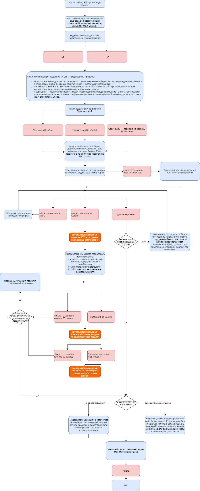

### Как тут что должно работать

При первом входе автоматом отправляется `/start`, после чего бот должен начать "разводить" клиента.
Реплики бота и его реакции см в диаграмме:

По команде `/edu` или после выхода из "развода" бот отправляет краткую справку по правилам кибербезопасности и предлагает пройти тест